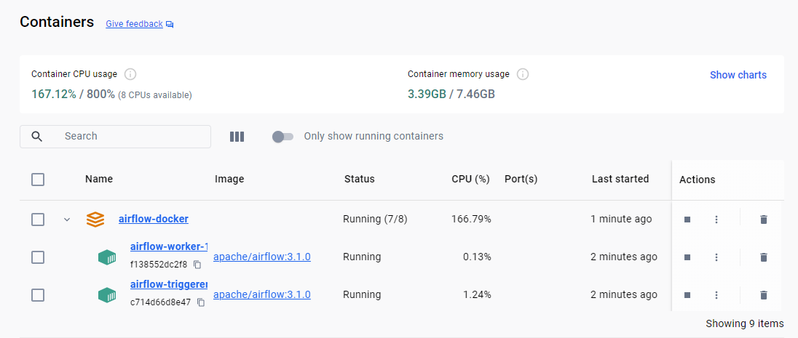
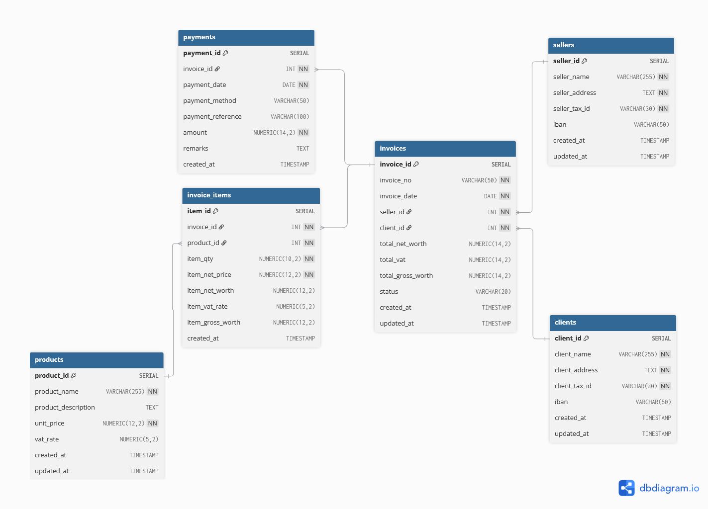
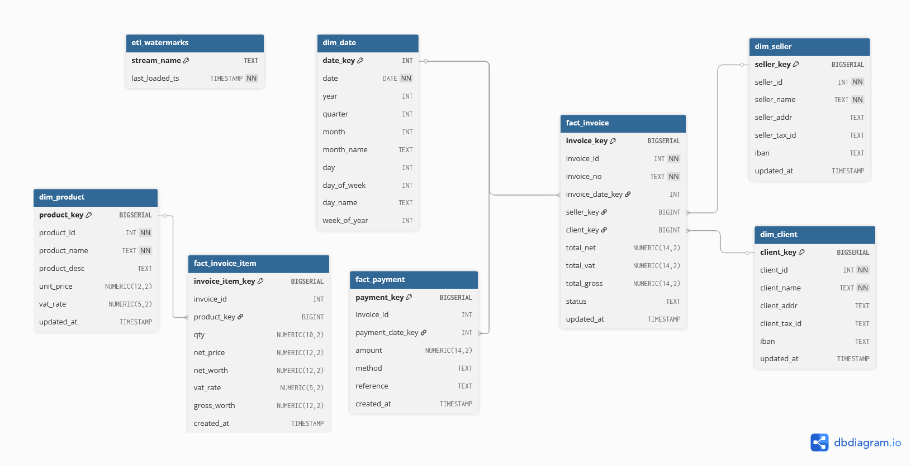

# 1- Environment Setup
## Steps to Run Airflow in Docker:
Install Docker and Docker Compose: Ensure you have Docker Desktop (for Windows/macOS) or Docker Engine and Docker Compose installed on your system.
### Create a Project Directory: 
```bash
mkdir airflow-docker && cd airflow-docker
```

### Prepare Directories for Airflow Components.
```bash
mkdir -p ./dags ./logs ./plugins
```
These directories will be mounted into Airflow containers for DAGs, logs, and custom plugins. Create an Environment File (.env).
```bash
echo -e "AIRFLOW_UID=$(id -u)" > .env
```
This sets the AIRFLOW_UID to host user ID, ensuring correct file permissions within the Docker containers. Fetch the Official docker-compose.yaml.
```bash
curl -LfO 'https://airflow.apache.org/docs/apache-airflow/stable/docker-compose.yaml'
```
This downloads the official Docker Compose file, which defines the Airflow services (webserver, scheduler, worker, database, etc.). Initialize Airflow.
```bash
docker compose up airflow-init
```
This command performs database migrations and creates the initial Airflow user. The default credentials are typically airflow/airflow. Launch Airflow Services.
```bash
docker compose up -d
```


This starts all the Airflow services in detached mode (-d), allowing them to run in the background.

# 2- PostgreSQL Schema — OLTP invoicing
All the files related to OLTP invoicing is present on path **invoicing-db-design/**.


```sql
-- ========================================
-- 1-Table: Clients
-- ========================================
CREATE TABLE clients (
    client_id SERIAL PRIMARY KEY,
    client_name VARCHAR(255) NOT NULL,
    client_address TEXT NOT NULL,
    client_tax_id VARCHAR(30) UNIQUE NOT NULL,
    iban VARCHAR(50),
    created_at TIMESTAMP DEFAULT CURRENT_TIMESTAMP,
    updated_at TIMESTAMP DEFAULT CURRENT_TIMESTAMP
);

-- ========================================
-- 2-Table: Sellers
-- ========================================
CREATE TABLE sellers (
    seller_id SERIAL PRIMARY KEY,
    seller_name VARCHAR(255) NOT NULL,
    seller_address TEXT NOT NULL,
    seller_tax_id VARCHAR(30) UNIQUE NOT NULL,
    iban VARCHAR(50),
    created_at TIMESTAMP DEFAULT CURRENT_TIMESTAMP,
    updated_at TIMESTAMP DEFAULT CURRENT_TIMESTAMP
);

-- ========================================
-- 3-Table: Products
-- ========================================
CREATE TABLE products (
    product_id SERIAL PRIMARY KEY,
    product_name VARCHAR(255) NOT NULL,
    product_description TEXT,
    unit_price NUMERIC(12,2) NOT NULL,
    vat_rate NUMERIC(5,2) DEFAULT 10.00,
    created_at TIMESTAMP DEFAULT CURRENT_TIMESTAMP,
    updated_at TIMESTAMP DEFAULT CURRENT_TIMESTAMP
);

-- ========================================
-- 4-Table: Invoices
-- ========================================
CREATE TABLE invoices (
    invoice_id SERIAL PRIMARY KEY,
    invoice_no VARCHAR(50) UNIQUE NOT NULL,
    invoice_date DATE NOT NULL,
    seller_id INT NOT NULL REFERENCES sellers(seller_id) ON DELETE CASCADE,
    client_id INT NOT NULL REFERENCES clients(client_id) ON DELETE CASCADE,
    total_net_worth NUMERIC(14,2) DEFAULT 0.00,
    total_vat NUMERIC(14,2) DEFAULT 0.00,
    total_gross_worth NUMERIC(14,2) DEFAULT 0.00,
    status VARCHAR(20) DEFAULT 'UNPAID',  -- UNPAID | PARTIALLY_PAID | PAID
    created_at TIMESTAMP DEFAULT CURRENT_TIMESTAMP,
    updated_at TIMESTAMP DEFAULT CURRENT_TIMESTAMP
);

-- ========================================
-- 5-Table: Invoice Items (Many-to-One → Invoices, Many-to-One → Products)
-- ========================================
CREATE TABLE invoice_items (
    item_id SERIAL PRIMARY KEY,
    invoice_id INT NOT NULL REFERENCES invoices(invoice_id) ON DELETE CASCADE,
    product_id INT NOT NULL REFERENCES products(product_id) ON DELETE RESTRICT,
    item_qty NUMERIC(10,2) NOT NULL CHECK (item_qty > 0),
    item_net_price NUMERIC(12,2) NOT NULL,
    item_net_worth NUMERIC(12,2) GENERATED ALWAYS AS (item_qty * item_net_price) STORED,
    item_vat_rate NUMERIC(5,2) DEFAULT 10.00,
    item_gross_worth NUMERIC(12,2) GENERATED ALWAYS AS (item_net_worth + (item_net_worth * item_vat_rate / 100)) STORED,
    created_at TIMESTAMP DEFAULT CURRENT_TIMESTAMP
);

-- ========================================
-- 6-Table: Payments (Many-to-One → Invoices)
-- ========================================
CREATE TABLE payments (
    payment_id SERIAL PRIMARY KEY,
    invoice_id INT NOT NULL REFERENCES invoices(invoice_id) ON DELETE CASCADE,
    payment_date DATE NOT NULL DEFAULT CURRENT_DATE,
    payment_method VARCHAR(50) CHECK (payment_method IN ('CASH', 'BANK_TRANSFER', 'CREDIT_CARD', 'CHECK', 'ONLINE')),
    payment_reference VARCHAR(100),
    amount NUMERIC(14,2) NOT NULL CHECK (amount > 0),
    remarks TEXT,
    created_at TIMESTAMP DEFAULT CURRENT_TIMESTAMP
);

-- ========================================
-- 7-Indexes
-- ========================================
CREATE INDEX idx_invoices_date ON invoices(invoice_date);
CREATE INDEX idx_invoice_items_invoice_id ON invoice_items(invoice_id);
CREATE INDEX idx_payments_invoice_id ON payments(invoice_id);
CREATE INDEX idx_products_name ON products(product_name);

-- ========================================
-- 8-Trigger for auto-update timestamps
-- ========================================
CREATE OR REPLACE FUNCTION update_timestamp()
RETURNS TRIGGER AS $$
BEGIN
    NEW.updated_at = CURRENT_TIMESTAMP;
    RETURN NEW;
END;
$$ LANGUAGE plpgsql;

CREATE TRIGGER trg_update_clients
BEFORE UPDATE ON clients
FOR EACH ROW EXECUTE FUNCTION update_timestamp();

CREATE TRIGGER trg_update_sellers
BEFORE UPDATE ON sellers
FOR EACH ROW EXECUTE FUNCTION update_timestamp();

CREATE TRIGGER trg_update_products
BEFORE UPDATE ON products
FOR EACH ROW EXECUTE FUNCTION update_timestamp();

CREATE TRIGGER trg_update_invoices
BEFORE UPDATE ON invoices
FOR EACH ROW EXECUTE FUNCTION update_timestamp();


```
### Populate tables from sample data

Sample data file (invoicing-db-design/ivoicing-data.txt) extrated from the provided link https://huggingface.co/datasets/katanaml-org/invoices-donut-data-v1 execute the below python script it will populate the data in the tables.
```bash
python .\insert_invoices.py
```
# insert_invoices.py
```python
import psycopg2
import json
from decimal import Decimal
from datetime import datetime

# ===============================
# PostgreSQL Connection Config
# ===============================
DB_CONFIG = {
    "dbname": "invoicing",
    "user": "{Your User}",
    "password": "{Your Password}",
    "host": "tap-assignments.cqncol5yfsyy.eu-west-1.rds.amazonaws.com",
    "port": "5432"
}

# ===============================
# Helper Functions
# ===============================

def get_or_create(cursor, table, unique_field, unique_value, insert_data):
    """Insert record if not exists, return id."""
    cursor.execute(f"SELECT {table[:-1]}_id FROM {table} WHERE {unique_field} = %s", (unique_value,))
    record = cursor.fetchone()
    if record:
        return record[0]
    columns = ', '.join(insert_data.keys())
    placeholders = ', '.join(['%s'] * len(insert_data))
    cursor.execute(f"INSERT INTO {table} ({columns}) VALUES ({placeholders}) RETURNING {table[:-1]}_id",
                   list(insert_data.values()))
    return cursor.fetchone()[0]

# ===============================
# Main Script
# ===============================

def insert_invoices_from_json(file_path):
    with open(file_path, 'r', encoding='utf-8') as f:
        data_lines = f.readlines()

    conn = psycopg2.connect(**DB_CONFIG)
    cur = conn.cursor()

    for line in data_lines:
        try:
            invoice_data = json.loads(line.strip())
            header = invoice_data['gt_parse']['header']
            items = invoice_data['gt_parse']['items']
            summary = invoice_data['gt_parse']['summary']

            # --- Insert Seller ---
            seller_id = get_or_create(
                cur,
                "sellers",
                "seller_tax_id",
                header['seller_tax_id'],
                {
                    "seller_name": header['seller'],
                    "seller_address": header['seller'],
                    "seller_tax_id": header['seller_tax_id'],
                    "iban": header['iban']
                }
            )

            # --- Insert Client ---
            client_id = get_or_create(
                cur,
                "clients",
                "client_tax_id",
                header['client_tax_id'],
                {
                    "client_name": header['client'],
                    "client_address": header['client'],
                    "client_tax_id": header['client_tax_id'],
                    "iban": header['iban']
                }
            )

            # --- Insert Invoice ---
            cur.execute("""
                INSERT INTO invoices (invoice_no, invoice_date, seller_id, client_id,
                                      total_net_worth, total_vat, total_gross_worth, status)
                VALUES (%s, %s, %s, %s, %s, %s, %s, 'UNPAID')
                ON CONFLICT (invoice_no) DO NOTHING
                RETURNING invoice_id
            """, (
                header['invoice_no'],
                datetime.strptime(header['invoice_date'], "%m/%d/%Y"),
                seller_id,
                client_id,
                Decimal(summary['total_net_worth'].replace('$', '').replace(',', '').strip()),
                Decimal(summary['total_vat'].replace('$', '').replace(',', '').strip()),
                Decimal(summary['total_gross_worth'].replace('$', '').replace(',', '').strip())
            ))

            invoice_row = cur.fetchone()
            if invoice_row:
                invoice_id = invoice_row[0]
            else:
                cur.execute("SELECT invoice_id FROM invoices WHERE invoice_no = %s", (header['invoice_no'],))
                invoice_id = cur.fetchone()[0]

            # --- Insert Items ---
            for item in items:
                product_id = get_or_create(
                    cur,
                    "products",
                    "product_name",
                    item['item_desc'],
                    {
                        "product_name": item['item_desc'],
                        "product_description": item['item_desc'],
                        "unit_price": Decimal(item['item_net_price'].replace(',', '.')),
                        "vat_rate": Decimal(item.get('item_vat', '10%').replace('%', '').strip())
                    }
                )
                item_vat_rate = Decimal(item.get('item_vat', '10%').replace('%', '').strip())
                item_qty = Decimal(item['item_qty'].replace(',', '.'))
                item_net_price = Decimal(item['item_net_price'].replace(',', '.'))
                item_net_worth = item_qty*item_net_price
                item_gross_worth = item_net_worth + (item_net_worth * item_vat_rate / 100)
                cur.execute("""
                    INSERT INTO invoice_items (invoice_id, product_id, item_qty, item_net_price, item_vat_rate, item_net_worth, item_gross_worth)
                    VALUES (%s, %s, %s, %s, %s, %s, %s)
                """, (
                    invoice_id,
                    product_id,
                    Decimal(item['item_qty'].replace(',', '.')),
                    Decimal(item['item_net_price'].replace(',', '.')),
                    Decimal(item.get('item_vat', '10%').replace('%', '').strip()),
                    item_net_worth,
                    item_gross_worth
                ))

            print(f"Inserted invoice {header['invoice_no']} successfully.")

        except Exception as e:
            print(f"Error processing line: {e}")
            conn.rollback()
        else:
            conn.commit()

    cur.close()
    conn.close()


if __name__ == "__main__":
    insert_invoices_from_json("ivoicing-data.txt")

```

### CRUD Operations

#### Create

```sql
-- Create Seller
INSERT INTO sellers (seller_name, seller_address, seller_tax_id, iban)
VALUES ('Whitaker, Gray and Green', '39588 Thomas Brook Suite 147 Sullivanshire, NH 40856', '987-82-9377', 'GB50UPCM86772611595760');

-- Create Client
INSERT INTO clients (client_name, client_address, client_tax_id, iban)
VALUES ('Davidson, Smith and Gill', '3577 Michael Fields Marquezstad, IL 48510', '967-95-5221', 'GB50UPCM86772611595760');

-- Add Products
INSERT INTO products (product_name, product_description, unit_price, vat_rate)
VALUES 
('36" Round Marble Dining Table', 'Marble Lapis Mosaic Floral Inlay', 1490.00, 10),
('12" Marble Side Coffee Table', 'Lapis Peacock Floral Inlay', 248.78, 10),
('6x3 Oval Marble Dining Table', 'Marquetry White Top Decor', 7193.76, 10);

-- Create Invoice
INSERT INTO invoices (invoice_no, invoice_date, seller_id, client_id, total_net_worth, total_vat, total_gross_worth)
VALUES ('15686725', '2021-11-03', 1, 1, 85850.39, 8585.04, 94435.43);

-- Add Invoice Items
INSERT INTO invoice_items (invoice_id, product_id, item_qty, item_net_price, item_vat_rate)
VALUES
(1, 1, 1.00, 1490.00, 10),
(1, 2, 3.00, 248.78, 10),
(1, 3, 2.00, 7193.76, 10);

-- Add Payment
INSERT INTO payments (invoice_id, payment_method, payment_reference, amount, remarks)
VALUES (1, 'BANK_TRANSFER', 'TXN-20211103-889', 50000.00, 'Partial payment received');

```
#### Read
```sql
-- Fetch full invoice with products and payment details
SELECT
    i.invoice_no,
    i.invoice_date,
    s.seller_name,
    c.client_name,
    p.product_name,
    ii.item_qty,
    ii.item_net_price,
    ii.item_gross_worth,
    pay.amount AS payment_amount,
    pay.payment_method,
    pay.payment_date
FROM invoices i
JOIN sellers s ON s.seller_id = i.seller_id
JOIN clients c ON c.client_id = i.client_id
JOIN invoice_items ii ON ii.invoice_id = i.invoice_id
JOIN products p ON p.product_id = ii.product_id
LEFT JOIN payments pay ON pay.invoice_id = i.invoice_id
WHERE i.invoice_no = '15686725';

```
#### Update
```sql
-- Update invoice totals after payment
UPDATE invoices
SET total_gross_worth = 94435.43,
    status = 'PARTIALLY_PAID'
WHERE invoice_no = '15686725';

-- Update product price
UPDATE products
SET unit_price = 1550.00
WHERE product_name = '36" Round Marble Dining Table';
```
#### Delete
```sql
-- Delete an invoice (cascades to items and payments)
DELETE FROM invoices WHERE invoice_no = '15686725';

-- Delete a product (will fail if referenced in invoice_items)
DELETE FROM products WHERE product_id = 1;
```
#### Design Highlights
| Feature                   | Description                                            |
| ------------------------- | ------------------------------------------------------ |
| **Normalized Design**     | Avoids duplication between invoices and products       |
| **Referential Integrity** | Cascades deletions from invoices → items → payments    |
| **Payment History**       | Allows multiple payments per invoice                   |
| **Timestamps & Indexes**  | Support fast queries for reporting and recent invoices |
| **Update triggers**       | Automatically refresh timestamps on updates            |

# 3- Invoicing OLTP → OLAP Data Pipeline

This project provides a **PostgreSQL-based OLTP → OLAP incremental ETL pipeline** for invoicing data using **Apache Airflow**.

---

### Folder Structure
```
project_root/
├── sql/                         # SQL scripts for OLAP schema and incremental upserts
│   ├── 01_create_olap_schema.sql
│   ├── 02_upsert_dimensions.sql
│   ├── 03_upsert_facts.sql
│   └── 04_init_watermarks.sql
├── dags/
│   └── invoice_elt_olap.py      # Airflow DAG performing incremental loads
└── README.md                    # This documentation
```

---

### Setup Instructions

#### 1️.Prerequisites
- **PostgreSQL** 14+.
- **Apache Airflow** 2.7+ with the **Postgres Provider** installed.

#### 2.Run Initial Schema Scripts
Execute these in order:
```bash
psql -d invoicing -f sql/01_create_olap_schema.sql
psql -d invoicing -f sql/04_init_watermarks.sql
```


#### 3.Airflow Connection Setup
In the **Airflow UI → Admin → Connections**, create:

| Conn Id   | Type        | Host        | Schema          | Login | Password | Port | Description |
|------------|--------------|--------------|------------------|--------|-----------|-------|--------------|
| `olap_pg` | Postgres     | host    | invoicing_olap   | user   | pass      | 5432  | Target OLAP |

Ensure connections are tested successfully.

#### 4.Deploy the DAG
Copy the `invoice_elt_olap.py` file into Airflow’s DAGs directory:
```bash
cp dags/invoice_elt_olap.py /airflow/dags/
cp sql/ -r /airflow/dags/sql
```
Then restart Airflow:
```bash
docker compose down
docker compose up -d
```
### Running Incremental Sync
1. Trigger the DAG manually from the Airflow UI.
2. The DAG will:
   - Load new or updated **clients**, **sellers**, **products** into dimensions.
   - Upsert **invoices** (with date + foreign key resolution).
   - Append new **invoice_items** and **payments**.
3. After first successful run, it updates `etl_watermarks` to maintain incremental sync.


### Testing

#### 1️.Run OLTP Inserts
```sql
INSERT INTO invoicing.clients (client_name, client_address, client_tax_id, iban)
VALUES ('Demo Client', 'Test Address', 'TAX-001', 'IBAN-DEMO');
```
#### 2️.Trigger the DAG
```bash
dag will run after every five minutes
```

#### 3️.Verify Results
```sql
-- In OLAP DB
SELECT * FROM invoicing_olap.dim_client ORDER BY updated_at DESC;
SELECT * FROM invoicing_olap.fact_invoice LIMIT 5;
```

### Maintenance Tips
- Periodically analyze OLAP tables for performance.
- Consider archiving old watermarks if ETL runs over a year.
- Add more granular logging by wrapping SQL tasks with Airflow XCom pushes.

### Future Enhancements
- Add **SCD Type 2** for product price/version tracking.
- Use **Airflow sensors** to detect new OLTP updates before ETL.

**Author:** Syed Aftab Alam 
**Purpose:** Real-time incremental load from transactional PostgreSQL (OLTP) → analytical PostgreSQL (OLAP) using Airflow.
